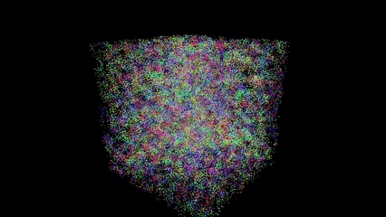
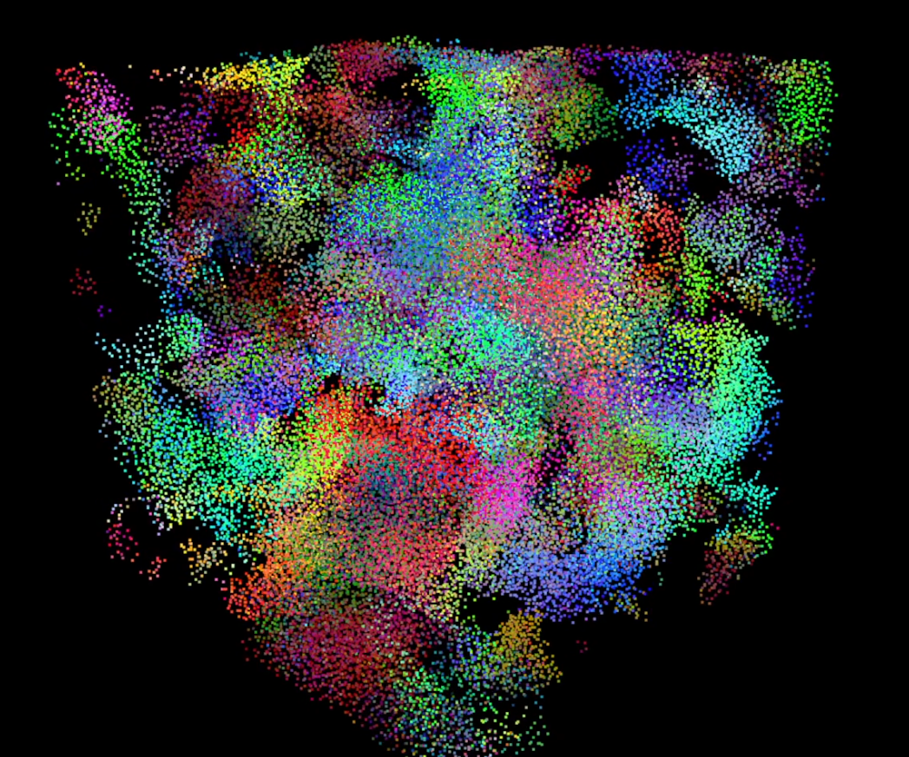
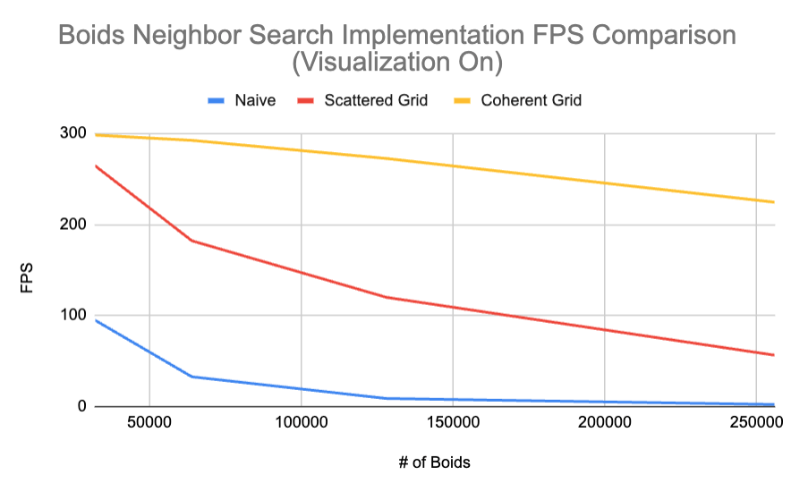
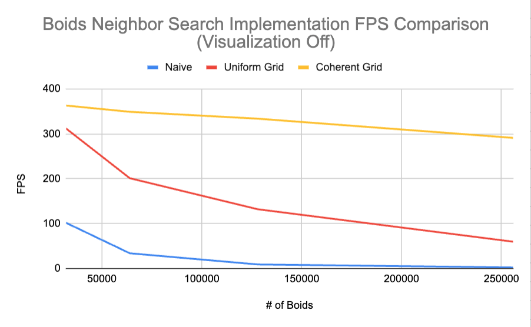
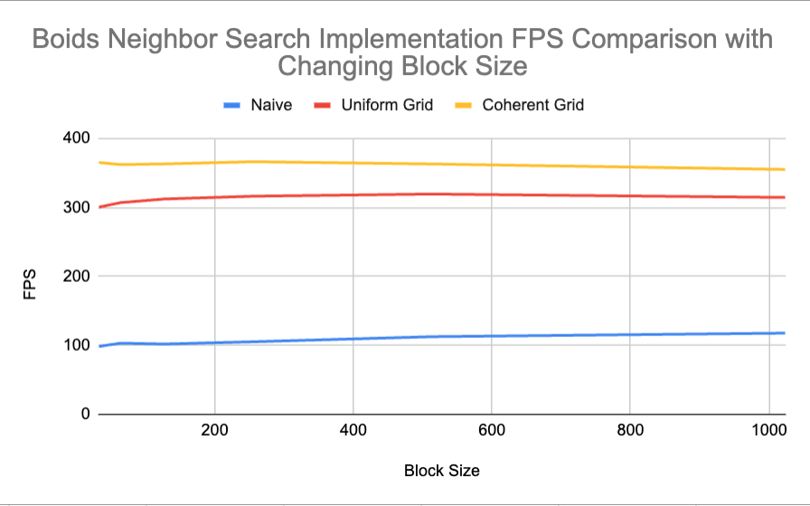

**University of Pennsylvania, CIS 5650: GPU Programming and Architecture,
Project 1 - Flocking**

* Rose Kelly
  * [LinkedIn](www.linkedin.com/in/rose-kelly-b480b01a8)
* Tested on: Windows 11, i7-13700F @ 2.10 GHz 16GB, RTX 4060-Ti 8GB (Personal Computer)

### Performance Analysis
#### Performance as Number of Boids Changes (Visualization On) [higher FPS is better]

| # of Boids    | Naive FPS   | Uniform Grid FPS   | Coherent Grid FPS   |
| ------------- | ------------- | ------------- | ------------- |
| 32000  | 95.1 |	264.8 |	298.2  |
| 64000  | 32.7	| 182.1 |	292.4 |
| 128000  | 8.9 |	120 |	272.5 |
| 256000  |2.3	| 56.4 |	224.4 |

#### Performance as Number of Boids Changes (Visualization Off) [higher FPS is better]

| # of Boids    | Naive FPS   | Uniform Grid FPS   | Coherent Grid FPS   |
| ------------- | ------------- | ------------- | ------------- |
| 32000  | 101.9 |	312.2	| 363  |
| 64000  | 33.9 |	201.1	| 349 |
| 128000  | 9	| 132	| 333.7|
| 256000  |2.3	| 59.6 |	290.9 |

#### Performance as Block Size Changes [higher FPS is better]

| Block Size| 	Naive |	Uniform Grid |	Coherent Grid |
| ------------- | ------------- | ------------- | ------------- |
|32|	98.3	|300.2	|365.1|
|64	|103.1|	306.9|	362|
|128|	101.9|	312.2|	363|
|256|	105.2|	316.2|	366.2|
|512|	112.5|	319.3|	362.9|
|1024|	117.7|	314.4|	355|

#### For each implementation, how does changing the number of boids affect performance? Why do you think this is?
For the naive implementation, the FPS drop-off as boids increase roughly resembles the drop-off of $`1 / x^2`$, which makes sense as the naive implementation is O($`n^2`$) since every boid checks every other boid as a possible neighbor. The drop-off in FPS for the uniform grid is a similar shape of dropoff but performs much better. The grid implementation should allow each boid to only check boids in the specified number of neighboring cells around it rather than every single other boid, explaining its far superior performance to the naive approach. However, increasing the number of boids without changing the cell and grid size of the container will increase the number of boids in any given cell; if you doubled the amount of boids in the simulation and thus, on average, doubled the amount of boids in every cell, the increase requires each boid to double how many comparisons it has to do. The number of comparisons would be something like:

n * (average percent of boids within max distance of any given boid) * n

which simplifies to $`n^2`$, explaining the similar shape of drop-off in performance between naive and uniform grid.
The coherent grid FPS almost looks linear. I think this is caused by the fact that the contiguous memory should decrease the performance hit of fetching memory for boids in any given cell since they are right next to each other and less reads should be required (the boids next to each other in memory should be cached together so you shouldn't need to fetch each element individually from its own place in memory like for the uniform grid). This could make the number of performance intensive operations look closer to n rather than `n^2`$ since you are increasing the number of times you need to fetch memory for each adjacent cell (ie for each boid) but you still only need to fetch all of the contiguous memory for each cell, which should be less expensive than fetching each boid in a cell individually.

#### For each implementation, how does changing the block count and block size affect performance? Why do you think this is?
For the naive implementation, increasing block size generally increased FPS, although it was a small change. Increasing the block size and thus number of warps per block could enable the scheduler to hide latency from stalls during memory fetches. If there are fewer warps, the scheduler has less opportunity to do this. This program reads the allocated memory for position and velocity quite frequently so it may be better suited to higher numbers of warps. 
The uniform grid implementation followed a similar pattern but had a drop in performance 1024 block size. The coherent grid implementation did not have a clear pattern but also had a drop in performance at 1024 block size. When using Nsight Compute when block size was 1024, Compute showed that this resulted in less blocks than SM's I had so some of the SM's were not being used, hurting performance. The grid implementations should have less memory fetches than the naive implementation since they check less boids per boid so the benefit of hiding latency by increasing the number of warps per block may be smaller for these approaches, allowing the performance hit of not fully utilizing the SM's available to outweigh this benefit, thus resulting in a slight decrease in performance at 1024 block size for the grid based approaches.

#### For the coherent uniform grid: did you experience any performance improvements with the more coherent uniform grid? Was this the outcome you expected? Why or why not?
Yes, my data shows significant FPS improvements between my uniform grid implementation and the coherent grid implementation. This was what I expected since the coherent grid allows for more contiguous reads and writes when calculating the velocity change from cohesion, separation and alignment with relevant neighbors. Specifically, shuffling the position and velocity buffers to allow the kernel to iterate through boids in the same cell in continuous memory decreases the amount of cache misses and time the program has to spend fetching from global memory.
I will note that the performance improvement was larger than I had anticipated it would be. I did not realize reducing the amount of reads for individual elements scattered across memory would so significantly increase FPS.

####  Did changing cell width and checking 27 vs 8 neighboring cells affect performance? Why or why not? Be careful: it is insufficient (and possibly incorrect) to say that 27-cell is slower simply because there are more cells to check!
I saw a performance improvement from the 27 neighboring cells (with width of max distance) approach. There are more cells to check but this should actually reduce the number of boids that are checked but not actually within neighborhood distance since the cells are a quarter of the size than they were before and thus each cell that's within max distance from the current boid is less likely to contain invalid boids (ie not within max distance). So this method is a performance improvement for uniform grid because we spend less time fetching the data for boids that we won't actually use in our calculations.

### EXTRA CREDIT: Shared Memory Optimization

I added a shared memory optimization to the scattered uniform grid approach by changing the neighbor search to have each block take a section of the shuffled boid indices, so it's more likely that any given thread in the block has the index of boid that is a neighbor to another thread in the block. Each block has shared memory containing the position and vel1 of every other boid the block takes care of. When the kernel is iterating through neighboring cells and checks each boid in those cells, it checks if that boid's information is stored in shared memory. If so, the information is pulled from shared memory instead of global memory. This results in a signficant improvement in performance from the scattered uniform grid to use of the scattered uniform grid with shared memory.

