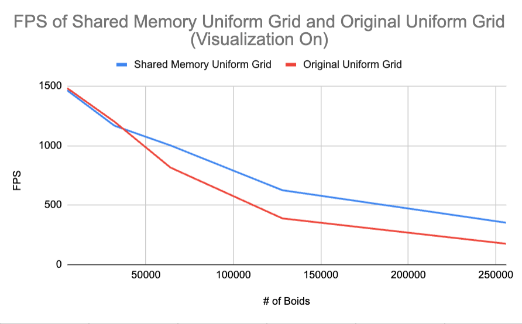
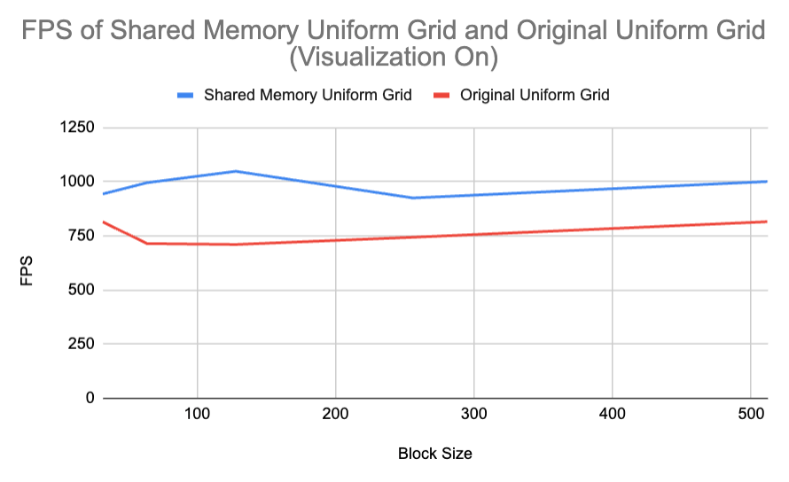
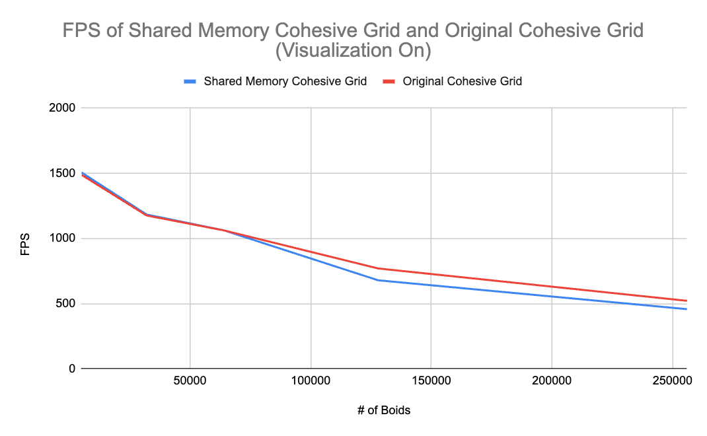

**University of Pennsylvania, CIS 5650: GPU Programming and Architecture,
Project 1 - Flocking**

* Rose Kelly
  * [LinkedIn](www.linkedin.com/in/rose-kelly-b480b01a8)
* Tested on: Windows 11, i7-13700F @ 2.10 GHz 16GB, RTX 4060-Ti 8GB (Personal Computer)

### Features
#### Naive Boids Simulation
First, I implemented flocking in CUDA using provided psuedo-code for cohesion, alignment, and separation. The kernel that calculates these for each boid runs a for loop checking every other boid for whether or not it's within max distance, and if so it calculates  cohesion, alignment, and separation between that boid and the boid the thread is dedicated to calculating velocity change for.

#### Scattered Uniform Grid Optimization
I added a uniform grid to avoid needlessly checking every single other boid that tracks what cell each boid is in. A buffer tracking what cell each boid is in is created and then sorted so the boid indices are in order of what cell they are in. This is used to quickly find all of the boids in a given cell since their indices are next to each other in memory. Instead of checking every other boid, only boids in cells within max distance are checked.

#### Coherent Uniform Grid Optimization
For this optimization, I sorted the position and velocity of the boids to also match the order of the cells. This cuts down on cache misses and global memory reads signficantly since boids in the same cell will always have all of their data checked in succession, so fetching all of that data together and caching it allows the block to avoid making global memory reads for each individual boid's information like in the Scattered Uniform Grid approach.

### Performance Analysis
#### Performance as Number of Boids Changes (Visualization On) [higher FPS is better]

[block size for measurements was 128]
| # of Boids    | Naive FPS   | Scattered Grid FPS   | Coherent Grid FPS   |
| ------------- | ------------- | ------------- | ------------- |
| 32000  | 95.1 |	264.8 |	298.2  |
| 64000  | 32.7	| 182.1 |	292.4 |
| 128000  | 8.9 |	120 |	272.5 |
| 256000  |2.3	| 56.4 |	224.4 |

#### Performance as Number of Boids Changes (Visualization Off) [higher FPS is better]

[block size for measurements was 128]
| # of Boids    | Naive FPS   | Scattered Grid FPS   | Coherent Grid FPS   |
| ------------- | ------------- | ------------- | ------------- |
| 32000  | 101.9 |	312.2	| 363  |
| 64000  | 33.9 |	201.1	| 349 |
| 128000  | 9	| 132	| 333.7|
| 256000  |2.3	| 59.6 |	290.9 |

#### Performance as Block Size Changes [higher FPS is better]

[# of boids for measurements was 32,000]
| Block Size| 	Naive |	Scattered Grid |	Coherent Grid |
| ------------- | ------------- | ------------- | ------------- |
|32|	98.3	|300.2	|365.1|
|64	|103.1|	306.9|	362|
|128|	101.9|	312.2|	363|
|256|	105.2|	316.2|	366.2|
|512|	112.5|	319.3|	362.9|
|1024|	117.7|	314.4|	355|

#### For each implementation, how does changing the number of boids affect performance? Why do you think this is?
For the naive implementation, the FPS drop-off as boids increase roughly resembles the drop-off of $`1 / x^2`$, which makes sense as the naive implementation is O($`n^2`$) since every boid checks every other boid as a possible neighbor. The drop-off in FPS for the scattered grid is a similar shape of dropoff but performs much better. The grid implementation should allow each boid to only check boids in the specified number of neighboring cells around it rather than every single other boid, explaining its far superior performance to the naive approach. However, increasing the number of boids without changing the cell and grid size of the container will proportionally increase the number of boids in any given cell; if you doubled the amount of boids in the simulation and thus, on average, doubled the amount of boids in every cell. The increase requires each boid to double how many comparisons it has to do. The number of comparisons would be something like:

n * (average percent of boids within max distance of any given boid) * n

which simplifies to $`n^2`$, explaining the similar shape of drop-off in performance between naive and scattered grid.
The coherent grid FPS almost looks linear. I think this is caused by the fact that the contiguous memory should decrease the performance hit of fetching memory for boids in any given cell since they are right next to each other and less reads should be required (the boids next to each other in memory should be cached together so you shouldn't need to fetch each element individually from its own place in memory like for the uniform grid). This could make the number of performance intensive operations look closer to n rather than `n^2`$ since you are increasing the number of times you need to fetch memory for each adjacent cell (ie for each boid) but you still only need to fetch all of the contiguous memory for each cell, which should be less global memory reads than fetching each boid in a cell individually like for the scattered approach.

#### For each implementation, how does changing the block count and block size affect performance? Why do you think this is?
For the naive implementation, increasing block size generally increased FPS, although it was a small change. Increasing the block size and thus number of warps per block could enable the scheduler to hide latency from stalls during memory fetches. If there are fewer warps, the scheduler has less opportunity to do this. This program reads the allocated memory for position and velocity quite frequently so it may be better suited to higher numbers of warps. 
The scattered grid implementation followed a similar pattern but had a drop in performance 1024 block size. The coherent grid implementation did not have a clear pattern but also had a drop in performance at 1024 block size. When using Nsight Compute when block size was 1024, Compute showed that this resulted in less blocks than SM's I had available so some of the SM's were not being used, hurting performance. The grid implementations should have less memory fetches than the naive implementation since they check less boids per boid so the benefit of hiding latency by increasing the number of warps per block may be smaller for these approaches, allowing the performance hit of not fully utilizing the SM's available to outweigh this benefit, thus resulting in a slight decrease in performance at 1024 block size for the grid based approaches where the naive approach does not see one.

#### For the coherent uniform grid: did you experience any performance improvements with the more coherent uniform grid? Was this the outcome you expected? Why or why not?
| # of Boids    | % Increase in FPS from Naive to Cohesive  |  % Increase in FPS from Scattered Grid to Cohesive  |
| ------------- | ------------- | ------------- |
| 32000  | 213.6% |	12.6%	|
| 64000  | 794.2% |	60.6%	| 
| 128000  | 296.2%	| 127.1%	| 
| 256000  |96.6%	| 297.9%|	

Yes, my data shows significant FPS improvements between my scattered grid implementation and the coherent grid implementation, and the improvements increased as the number of elements went up. This was what I expected since the coherent grid allows for more contiguous reads and writes when calculating the velocity change from cohesion, separation and alignment with relevant neighbors. Specifically, shuffling the position and velocity buffers to allow the kernel to iterate through boids in the same cell in continuous memory decreases the amount of cache misses and time the program has to spend fetching from global memory. The performance gap between scattered and cohesive widening as elements increased also follows my reasoning given in question 1 for why FPS appears to decrease almost linearly for coherent while for scattered it looks closer to an inverse square function.
I will note that the performance improvement was larger than I had anticipated it would be. I did not realize reducing the amount of reads for individual elements scattered across memory would so significantly increase FPS.

####  Did changing cell width and checking 27 vs 8 neighboring cells affect performance? Why or why not? Be careful: it is insufficient (and possibly incorrect) to say that 27-cell is slower simply because there are more cells to check!

| 8 Neighboring Cells, 2x Width | 27 Neighboring Cells, 1x Max Width |
| ------------- | ------------- |
| 546.766 FPS | 599.334 FPS |

I saw a performance improvement of 9.6% from the 27 neighboring cells (with width of 1x max distance) approach. There are more cells to check but this should actually reduce the number of boids that are checked but not actually within neighborhood distance since the cells are an eighth of the size than they were before and thus each cell that's within max distance from the current boid is less likely to contain invalid boids (ie not within max distance). So this method is a performance improvement for uniform grid because we spend less time fetching the data for boids that we won't actually use in our calculations.

## EXTRA CREDIT: Shared Memory Optimization

I attempted a shared memory optimization for both the scattered grid and cohesive grid and provide my results below.

I added a shared memory optimization to the scattered uniform grid approach by changing the neighbor search to have each block take a contiguous section of the cell-order-sorted boid indices, so it's more likely that any given thread in the block is responsible for a boid that is a neighbor to another thread's boid in the block. Each block has shared memory containing the position and vel1 of every other boid the block takes care of. When the kernel is iterating through neighboring cells and checks each boid in those cells, it checks if that boid's information is stored in shared memory. If so, the information is pulled from shared memory instead of global memory. This results in a signficant improvement in performance from the scattered uniform grid to use of the scattered uniform grid with shared memory.

NOTE: you may notice FPS here is  quite a bit higher than my previous data. I have seen that FPS can vary wildly if measurements are taken at different times of day. However, when I run tests to measure FPS in a short time period my results are relatively consistent. I assume this is due to other processes on my computer taking resources and affecting my computer's performance.

#### Performance as Number of Boids Changes (Visualization On) [higher FPS is better]

[# of boids for measurements was 64,000]

| # of Boids   | Shared Memory Scattered Grid FPS   | Scattered Grid FPS   |
| ------------- | ------------- | ------------- |
| 5000|	1463.8|	1482.38|
|32000|	1167|	1200.81|
|64000|	1001.43|	815.848|
|128000|	625.238|	388.474|
|256000|	352.299|	175.379|

As you can see the shared memory scattered grid approach generally has higher FPS, with a smaller gap when there are fewer boids. The cause of this could be there are less cache misses when there are fewer boids in the original scattered grid approach so the benefit of shared memory is less noticeable, and the overhead is comparitively more noticeable.

#### Performance as Block Size Changes [higher FPS is better]

[block size for measurements was 512]

| # of Boids   | Shared Memory Scattered Grid FPS   | Scattered Grid FPS   |
| ------------- | ------------- | ------------- |
|32|	943.922|	814.905|
|64|	996.03|	714.868|
|128|	1048.77|	710.524|
|256|	925.458|	743.987|
|512|	1001.43|	815.848|

NOTE: 1024 block size was not recorded as this caused the kernel to go over the limit of shared memory (the two shared memory buffers had same number of elements as block size)

There wasn't a significant change as block size changed, but shared memory approach generally saw an increase in FPS as block size increased. This makes sense, as larger block size meant more shared memory was stored and there were more boids from shared memory that could be accessed, reducing the number of global reads required.

### Cohesive Uniform Grid Comparison

[block size for measurements was 128]

This approach did not significantly impact the performance of the cohesive uniform grid approach since it relies on the same optimization to improve performance: making less global memory reads. The cohesive approach is an optimization because it uses the cache to store boid data from the same cell and adjacent cells to reduce the number of global reads. Similarly, the shared memory approach allows the neighbor search to avoid global reads for other boids in that block (which are likely to be neighbors since they are in either the same cell or adjacent cells). The shared memory approach also comes with overhead of storing data in shared memory and additional checks for whether shared memory or the cache/global memory should be checked for boid information, so the shared memory approach could be slower because of this baggage.